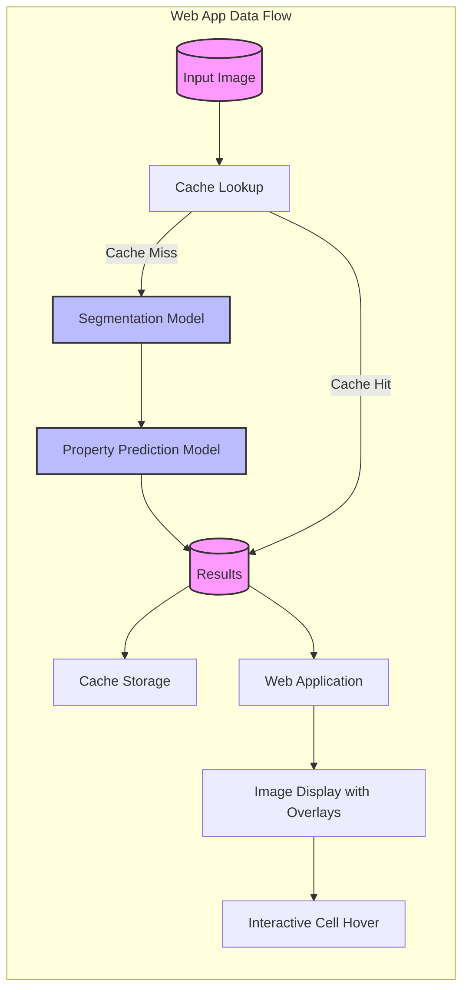

```mermaid
flowchart LR
	subgraph Web App Data Flow
	    A[(Input Image)] --> B[Cache Lookup]

	    B -- "Cache Miss" --> C[Segmentation Model]
	    C --> D[Property Prediction Model]
	    D --> E[(Results)]
	    E --> F[Cache Storage]

	    B -- "Cache Hit" --> E

	    E --> G[Web Application]
	    G --> H[Image Display with Overlays]
	    H --> I[Interactive Cell Hover]

	    classDef artifact fill:#f9f,stroke:#333,stroke-width:2px;
	    classDef model fill:#bbf,stroke:#333,stroke-width:2px;

	    class A,E artifact;
	    class C,D model;
	end
```
